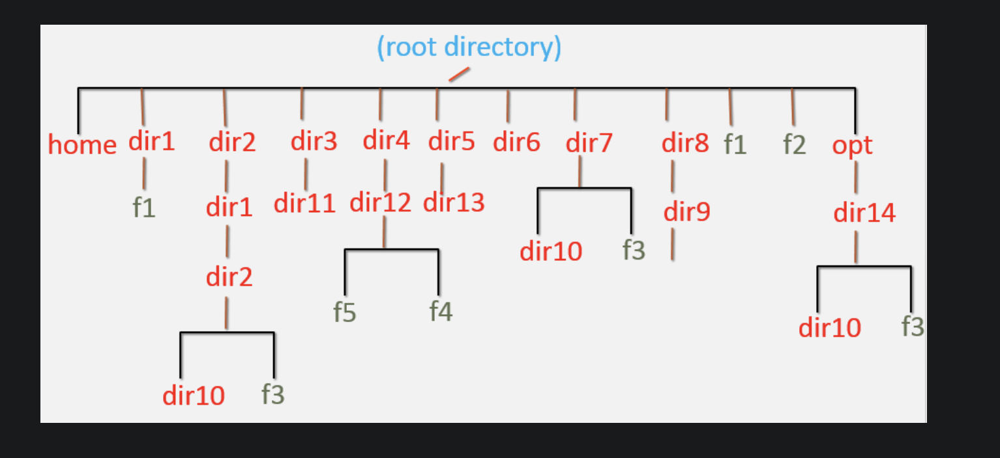

# Pre-Requisites

* To complete the assignment below, log in to AWS cloud and create a Linux-based EC2 instance or run on VMware.

# Root Directory

# Deployment
[1 to 4](md/1to4.md)

1. Login to the server as super user and perform below
* Create users and set passwords – user1, user2, user3
* Create Groups – devops, aws
* Change primary group of user2, user3 to ‘devops’ group
* Add ‘aws’ group as secondary group to the ‘user1’
* Create the file and directory structure shown in the above diagram.
* Change group of /dir1, /dir7/dir10, /f2 to “devops” group
* Change ownership of /dir1, /dir7/dir10, /f2 to “user1” user.

2. Login as user1 and perform below
* Create users and set passwords – user4, user5
* Create Groups – app, database

3. Login as ‘user4’ and perform below
* Create directory – /dir6/dir4
* Create file – /f3
* Move the file from “/dir1/f1” to “/dir2/dir1/dir2”
* Rename the file ‘/f2′ to /f4’

4. Login as ‘user1’ and perform below
* Create directory – “/home/user2/dir1”
* Change to “/dir2/dir1/dir2/dir10” directory and create file “/opt/dir14/dir10/f1” using relative path method.
* Move the file from “/opt/dir14/dir10/f1” to  user1 home directory
* Delete the directory recursively “/dir4”
* Delete all child files and directories under “/opt/dir14” using single command.
* Write this text “Linux assessment for an DevOps Engineer!! Learn with Fun!!” to the /f3 file and save it.

[4 to 11](md/4to11.md)

5. Login as ‘user2’ and perform below
* Create file “/dir1/f2”
* Delete /dir6
* Delete /dir8
* Replace the “DevOps” text to “devops” in the /f3 file without using  editor.
* Using Vi-Editor copy the line1 and paste 10 times in the file /f3.
* Search for the pattern “Engineer” and replace with “engineer” in the file /f3 using single command.
* Delete /f3

6. Login as ‘root’ user and perform below
* Search for the file name ‘f3’ in the server and list all absolute  paths where f3 file is found.
* Show the count of the number of files in the directory ‘/’
* Print last line of the file ‘/etc/passwd’

7. Login to AWS and create 5GB EBS volume in the same AZ of the EC2 instance and attach EBS volume to the Instance.

8. Login as ‘root’user and perform below
* Create File System on the new EBS volume attached in the previous step
* Mount the File System on /data directory
* Verify File System utilization using ‘df -h’ command – This command must show /data file system
* Create file ‘f1’ in the /data file system.

9. Login as ‘user5’ and perform below
* Delete /dir1
* Delete /dir2
* Delete /dir3
* Delete /dir5
* Delete /dir7
* Delete /f1 & /f4
* Delete /opt/dir14

10. Logins as ‘root’ user and perform below
* Delete users – ‘user1, user2, user3, user4, user5’
* Delete groups – app, aws, database, devops
* Delete home directories  of all users ‘user1, user2, user3, user4, user5’ if any exists still.
* Unmount /data file system
* Delete /data directory

11. Login to AWS and detach EBS volume to the EC2 Instance and delete the volume and then terminate EC2 instance.
