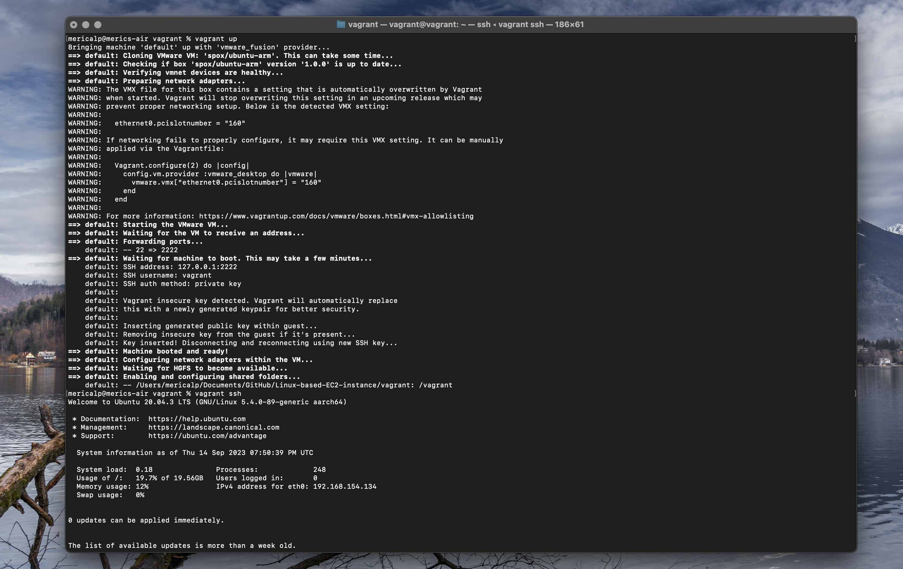
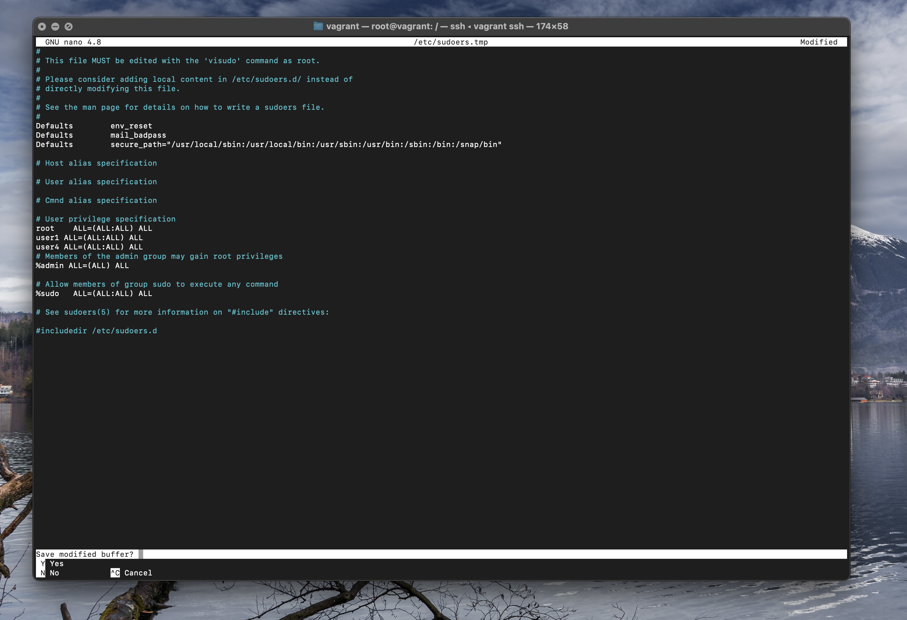

# 4.

```
su - user1
mkdir /home/user2/dir1
touch /opt/dir14/dir10/f1
mv /opt/dir14/dir10/f1 /home/user1/
rm -r /dir4
# You can use the find command to delete all subfiles and directories under "/opt/dir14":
find /opt/dir14 -type d -exec rm -r {} \;
nano /f3 
or 
vi /f3
```

# 3.

```
su - user4
mkdir -p /dir6/dir4
touch /f3
ls /dir1/f1
# If there is file /dir1/f1, we can move it to /dir 2/dir 1/dir 2
mv /dir1/f1 /dir2/dir1/dir2
mv /f2 /f4
```

# 2.
Switch to User1
```
su - user1
```

Create Users and Set Passwords
```
sudo useradd user4
sudo passwd user4
sudo useradd user5
sudo passwd user5

```

Create Groups
```
sudo groupadd application
sudo groupadd database
```

# 1.

```
sudo -i
```

Create users and set their passwords
```
sudo useradd user1
sudo useradd user
sudo useradd user3
sudo passwd user1
sudo passwd user2
sudo passwd user3
```

Create groups
```
sudo groupadd devops
sudo groupadd aws
```

Change the primary group of user2 and user3 to 'devops'
```
sudo usermod -g devops kullanıcı2
sudo usermod -g devops kullanıcı3
```

Add group 'aws' as secondary group to 'user1':
```
sudo usermod -a -G aws kullanıcı1
```

Create the desired directories and files and set group ownership and user ownership
```
sudo mkdir /dir1
sudo mkdir -p /dir7/dir10
sudo touch /f2
sudo chown :devops /dir1 /dir7/dir10 /f2
sudo chown kullanıcı1 /dir1 /dir7/dir10 /f2
```


